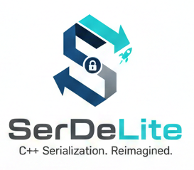

<p align="center">
  
</p>

## ⚖️ License
SerDeLite is licensed under the **MIT License**. Full details are available in the `LICENSE` file.

# SerDeLite 🚀

**SerDeLite** is a lightweight, high-performance C++ serialization library designed for deterministic environments. It provides a unified framework for converting C++ objects into compact **Binary** formats and human-readable **JSON** with zero external dependencies.

## 📥 Direct Downloads
The latest stable binaries and header bundles are available for manual integration.

* **[Download Latest Windows Release (v1.0.0)](https://github.com/Devansh-Seth-DEV/SerDeLite/releases/latest)**
    * *Includes: `libserdelite.a` (UCRT64/x64) and full `include/` directory.*

---

<br>

## 🌟 Core Value Proposition

SerDeLite is engineered for developers who require absolute control over memory and performance. 

* **Deterministic Memory (Zero-Allocation):** Operates entirely on user-provided buffers. By avoiding heap allocations during streaming, SerDeLite eliminates risks of memory fragmentation and `malloc` latency.
* **Architectural Transparency:** Built-in endianness awareness ensures data integrity across different CPU architectures (Little-Endian vs. Big-Endian) without manual byte-swapping.
* **Unified Interface:** A single object definition provides dual-format support. Use compact Binary for high-speed networking and JSON for configuration or debugging.

---


## 🛠️ Technical Specifications
SerDeLite provides native support for a wide range of primitive types, ensuring consistent serialization across different architectures.

### Supported Data Types
| Category | Types Supported | Stream Methods |
| :--- | :--- | :--- |
| **Integers** | `uint8`, `int8`, `uint16`, `int16`, `uint32`, `int32`, `uint64`, `int64` | `writeUintXX`, `readUintXX` |
| **Floating Point** | `float` (32-bit), `double` (64-bit) | `writeFloat`, `writeDouble` |
| **Booleans** | `bool` (serialized as 1-byte) | `writeBool`, `readBool` |
| **Strings** | UTF-8 / ASCII null-terminated | `writeString`, `readString` |
| **Custom Objects** | Classes implementing `ByteSerializable` | `writeObject` |

---


## 🔧 Architecture Overview
The library is divided into four distinct layers to ensure separation of concerns:

1.  **Physical Layer (`ByteBuffer`):** Direct management of the raw memory storage.
2.  **Logic Layer (`ByteStream` / `JsonStream`):** Implementation of serialization protocols.
3.  **Interface Layer (`Serializable`):** The contract used by custom classes to enable streaming.
4.  **Presentation Layer (`JsonBuffer`):** Tools for visualizing data in human-readable formats.

---
<br>

## 📦 Installation & Deployment

### Windows (MinGW/UCRT64)
Pre-compiled binaries for Windows x64 are available for immediate use.

1. **Download** the `libserdelite.a` from the [Latest Release](https://github.com/Devansh-Seth-DEV/SerDeLite/releases).
2. **Add** the `include` folder to your project's include path.
3. **Link** the library using the following compiler flags:
   ```bash
   -L./bin -lserdelite

### Build from Source
If a custom build is required, the library can be compiled directly from the source code using the following commands:

#### 1. Compile source files into object files
```bash
g++ -c -I./include src/serdelite/*.cpp
```

#### 2. Bundle object files into a static library
```bash
ar rcs bin/libserdelite.a *.o
```

<br>

## 🚀 Getting Started

### 1. Define a Serializable Object
Inherit from `ByteSerializable` and `JsonSerializable` to enable dual-format support.

```cpp
#include <serdelite.h>

class Player : public ByteSerializable,
               public JsonSerializable {
public:
    uint32_t id;
    float health;

    Player(uint32_t _id, float _health)
      : id(_id), health(_health) {}

    // Binary logic
    bool toByteStream(ByteStream& s) const override {
        return s.writeUint32(id) &&
               s.writeFloat(health);
    }

    size_t byteSize() const override {
      return sizeof(id) + sizeof(health);
    }

protected:
    // JSON logic
    bool serializeToJson(JsonStream& s) const override {
        return s.writeUint32("id", id) &&
               s.writeFloat("health", health);
    }
};
```

### 2. Binary Serialization
```cpp
uint8_t mem[128];
ByteBuffer buffer(mem, sizeof(mem));
ByteStream stream(buffer);

// Write SerDeLite header
stream.writeLibraryHeader();

Player p(101, 95.5f);
bool success = stream.writeObject(p);
if (!success) printf("Failed to serialize Player!\n");
```

### 3. Binary Deserialization
```cpp
// Reset the read cursor first
stream.resetReadCusror();

if (stream.isSerdeliteBuffer() &&
    stream.verifyLibraryHeader()) {
   buffer.dump();

   Player p2;

   // Read the previously written player object(p) and store it into p2
   bool success = stream.readObject(p2);
   if (!success) printf("Failed to write player p into player p2");
   else {
      printf("ID: %u\n", p2.id);
      printf("Health: %.1f\n", p2.health);
   }
}
```


### 3. JSON Export & Visualization
```cpp
uint8_t mem[128];
ByteBuffer buffer(mem, sizeof(mem));
JsonStream jStream(buffer);

bool success = p.toJson(jStream);
if (!success) printf("Failed to serialize player to Json!");
else jStream.getJson().printPretty();
```